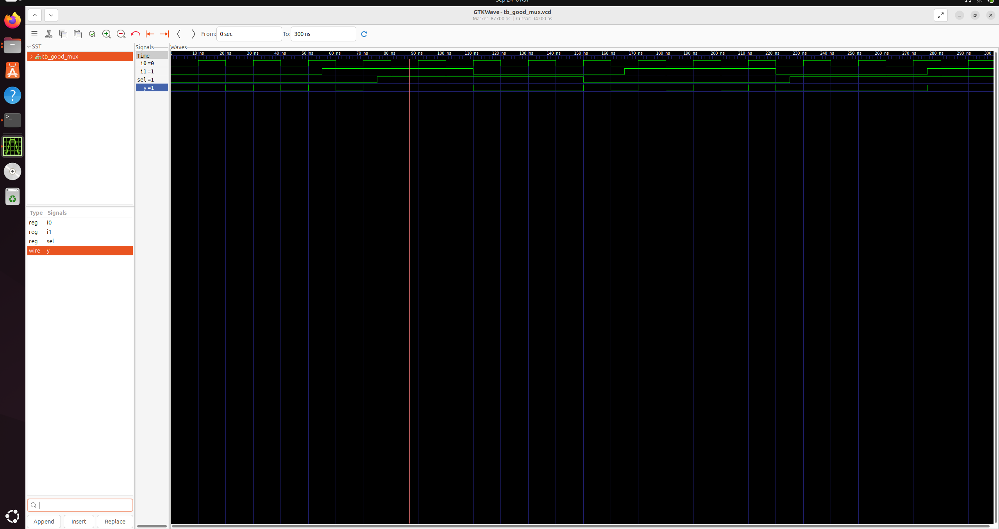
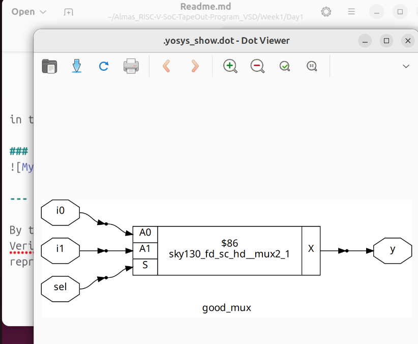

# Day 1: My First Steps in Verilog RTL Design and Synthesis

On the first day, I dove into the world of digital design using Verilog. I learned to use open-source tools like Icarus Verilog for simulation and Yosys for logic synthesis. This guide provided hands-on labs and key concepts that helped me build a solid foundation in RTL design.

## What I Learned

- **Simulation**: How to test my Verilog code.
- **Synthesis**: How to convert my code into a hardware-level design.
- **Hands-on Labs**: Practical exercises with a 2-to-1 multiplexer.

---

## Lab 1: Simulating a 2-to-1 Multiplexer

First, I simulated a 2-to-1 multiplexer to see how my Verilog code behaves.

### Steps I Took to Generate the Waveform:

1.  **Installed Tools**:
    ```shell
    sudo apt update
    sudo apt install iverilog gtkwave
    ```

2.  **Simulated the Design**:
    I compiled the Verilog design (`good_mux.v`) and its testbench (`tb_good_mux.v`).
    ```shell
    iverilog good_mux.v tb_good_mux.v 
    ```

3.  **Ran the Simulation**:
    ```shell
    ./a.out
    ```

4.  **Viewed the Waveform**:
    I opened the output file with GTKWave to visualize the signals.
    ```shell
    gtkwave tb_good_mux.vcd
    ```
    I saved a screenshot of my waveform as `gtkwave.png` in this directory.

### My Multiplexer Waveform:


---

## Lab 2: Synthesizing the Multiplexer

Next, I converted my Verilog code into a gate-level netlist using Yosys.

### Steps I Took to Synthesize the Design:

1.  **Launched Yosys**:
    ```shell
    yosys
    ```

2.  **Loaded the Liberty Library**:
    I pointed to my Sky130 library file.
    ```yosys
    read_liberty -lib /path/to/sky130_fd_sc_hd__tt_025C_1v80.lib
    ```

3.  **Read My Verilog File**:
    ```yosys
    read_verilog good_mux.v
    ```

4.  **Synthesized and Mapped to Gates**:
    ```yosys
    synth -top good_mux
    abc -liberty /path/to/sky130_fd_sc_hd__tt_025C_1v80.lib
    ```

5.  **Visualized the Netlist**:
    This command showed me the synthesized circuit.
    ```yosys
    show
    ```
    I took a screenshot of the netlist and saved it as `Netlist.png` in this directory.

### My Synthesized Netlist:


---

By the end of Day 1, I had successfully simulated and synthesized a Verilog module, turning my code into a visual hardware representation.


