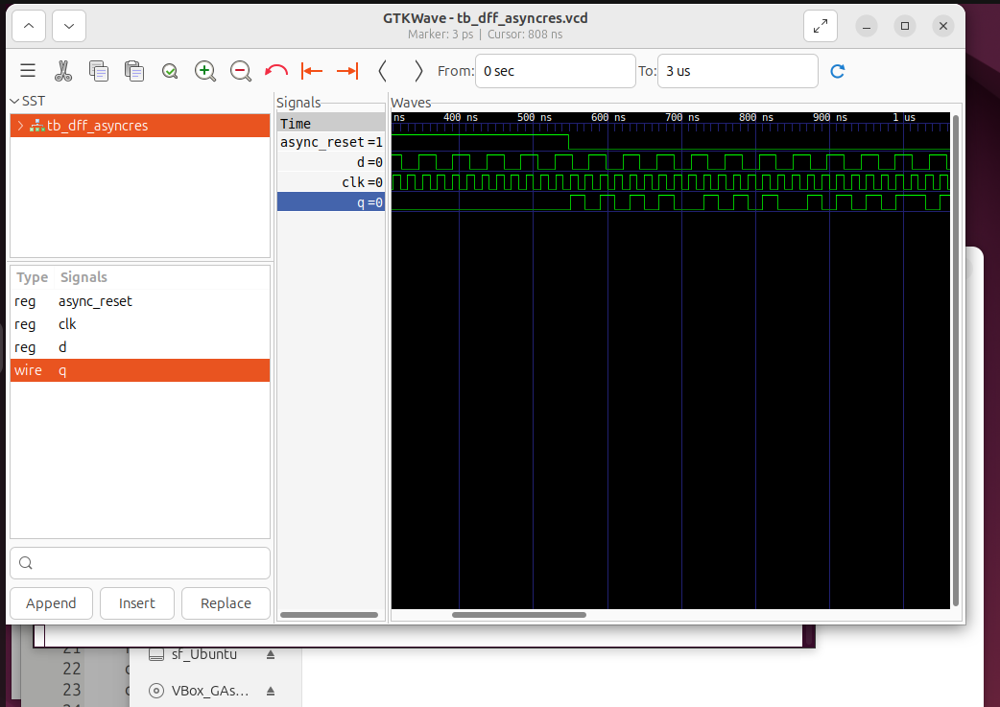
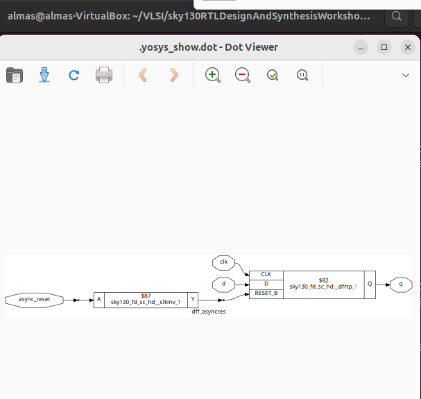

# Day 2: Exploring Timing Libraries, Synthesis, and Flip-Flops

On Day 2, I explored timing libraries, different synthesis approaches, and how to code flip-flops efficiently. This helped me understand how designs are optimized and prepared for hardware.

## What I Learned

-   **Timing Libraries**: I learned about the `.lib` files that describe the characteristics of standard cells, like those in the Sky130 PDK.
-   **Synthesis Methods**: I compared hierarchical and flattened synthesis to see how they impact optimization and design structure.
-   **Flip-Flop Coding**: I practiced writing Verilog for different types of flip-flops.

---

## Lab 1: Simulating a D-Flip-Flop

I started by simulating a D-flip-flop to understand its behavior.

### Steps I Took to Generate the Waveform:

1.  **Simulate the Design**:
    I compiled my D-flip-flop Verilog file (`dff.v`) and its testbench (`tb_dff.v`).
    ```shell
    iverilog dff.v tb_dff.v
    ```

2.  **Run and View**:
    I ran the simulation and opened the waveform in GTKWave.
    ```shell
    ./a.out
    gtkwave tb_dff.vcd
    ```
    I saved a screenshot of my waveform as `dff_gtk.png`.

### My D-Flip-Flop Waveform:


---

## Lab 2: Synthesizing the D-Flip-Flop

Next, I synthesized the D-flip-flop to see its gate-level implementation.

### Steps I Took to Synthesize:

1.  **Launch Yosys and Load Library**:
    ```yosys
    yosys
    read_liberty -lib /path/to/sky130_fd_sc_hd__tt_025C_1v80.lib
    ```

2.  **Read, Synthesize, and Map**:
    ```yosys
    read_verilog dff.v
    synth -top dff
    abc -liberty /path/to/sky130_fd_sc_hd__tt_025C_1v80.lib
    ```

3.  **Visualize the Netlist**:
    ```yosys
    show
    ```
    I took a screenshot of the circuit and saved it as `dff_netlist.png`.

### My Synthesized D-Flip-Flop:


---

## Lab 3: Hierarchical vs. Flattened Synthesis

I experimented with both hierarchical and flattened synthesis to understand the trade-offs.

### Hierarchical Synthesis:
I ran synthesis while preserving the module hierarchy.
```yosys
synth -top my_design
```
I took a screenshot of the result and saved it as `hierarchical.png`.

#### My Hierarchical Result:


### Flattened Synthesis:
I used the `flatten` command to merge all modules into one.
```yosys
synth -top my_design -flatten
```
I took a screenshot of the result and saved it as `flattened.png`.

#### My Flattened Result:


---

By the end of Day 2, I had a much better grasp of how synthesis tools work and how my coding style affects the final hardware.

## Timing Libraries

### SKY130 PDK Overview

The SKY130 PDK is an open-source Process Design Kit based on SkyWater Technology's 130nm CMOS technology. It provides essential models and libraries for integrated circuit (IC) design, including timing, power, and process variation information.

### Decoding tt_025C_1v80 in the SKY130 PDK

- **tt**: Typical process corner.
- **025C**: Represents a temperature of 25°C, relevant for temperature-dependent performance.
- **1v80**: Indicates a core voltage of 1.8V.

This naming convention clarifies which process, voltage, and temperature conditions the library models.

---

### Opening and Exploring the .lib File

To open the sky130_fd_sc_hd__tt_025C_1v80.lib file:

1. **Install a text editor:**
   ```shell
   sudo apt install gedit
   ```
2. **Open the file:**
   ```shell
   gedit sky130_fd_sc_hd__tt_025C_1v80.lib
   ```
 


---

## Hierarchical vs. Flattened Synthesis

### Hierarchical Synthesis

- **Definition**: Retains the module hierarchy as defined in RTL, synthesizing modules separately.
- **How it Works**: Tools like Yosys process each module independently, using commands such as `hierarchy` to analyze and set up the design structure.

**Advantages:**
- Faster synthesis time for large designs.
- Improved debugging and analysis due to maintained module boundaries.
- Modular approach, aiding integration with other tools.

**Disadvantages:**
- Cross-module optimizations are limited.
- Reporting can require additional configuration.

---

## Flip-Flop Coding Styles

Flip-flops are fundamental sequential elements in digital design, used to store binary data. Below are efficient coding styles for different reset/set behaviors.

### Asynchronous Reset D Flip-Flop

```verilog
module dff_asyncres (input clk, input async_reset, input d, output reg q);
  always @ (posedge clk, posedge async_reset)
    if (async_reset)
      q <= 1'b0;
    else
      q <= d;
endmodule
```
- **Asynchronous reset**: Overrides clock, setting q to 0 immediately.
- **Edge-triggered**: Captures d on rising clock edge if reset is low.

### Asynchronous Set D Flip-Flop

```verilog
module dff_async_set (input clk, input async_set, input d, output reg q);
  always @ (posedge clk, posedge async_set)
    if (async_set)
      q <= 1'b1;
    else
      q <= d;
endmodule
```
- **Asynchronous set**: Overrides clock, setting q to 1 immediately.

### Synchronous Reset D Flip-Flop

```verilog
module dff_syncres (input clk, input async_reset, input sync_reset, input d, output reg q);
  always @ (posedge clk)
    if (sync_reset)
      q <= 1'b0;
    else
      q <= d;
endmodule
```
- **Synchronous reset**: Takes effect only on the clock edge.

---

---
## Summary
This overview provides you with practical insights into timing libraries, synthesis strategies, and reliable coding practices for flip-flops. Continue experimenting with these concepts to deepen your understanding of RTL design and synthesis.

