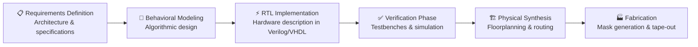
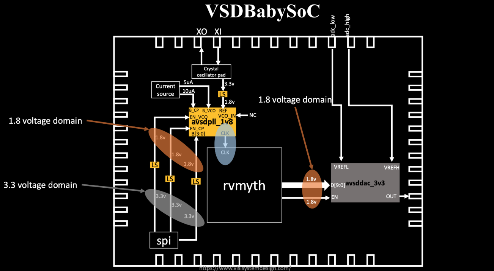
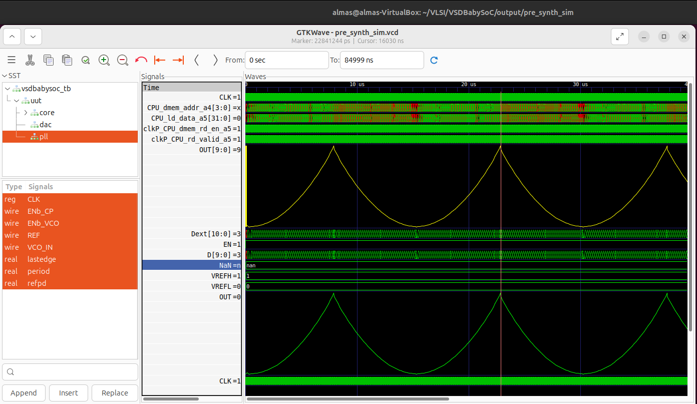

# 🚀 System-on-Chip (SoC) Design Essentials  


## 💡 Understanding System-on-Chip Architecture  

A **System-on-Chip (SoC)** represents the ultimate integration of computing components—an **entire computational system consolidated onto a single piece of silicon.**  

This revolutionary approach combines critical subsystems including:
- Central Processing Units (CPU)
- Graphics Processing Units (GPU)  
- Memory hierarchies (RAM, ROM, Flash)
- Digital Signal Processors (DSP)
- Input/Output peripherals
- Power regulation circuits
- Wireless communication modules

### 🎯 The SoC Advantage  
| Benefit | Impact |
|---------|--------|
| 🏗️ **Miniaturization** | Enables ultra-compact form factors for portable electronics |
| ⚡ **Power Optimization** | Dramatically reduces energy consumption—critical for battery-powered devices |
| 🚄 **Performance Boost** | On-chip interconnects minimize communication delays |
| 💵 **Economic Efficiency** | Single-chip solution eliminates need for multiple discrete ICs |

---

## 🔧 Building Blocks of Modern SoCs  

### Functional Subsystems

**🖥️ Central Processing Unit (CPU)**  
The command center executing instructions and coordinating all system operations.

**💾 Memory Subsystem**  
Hierarchical storage (RAM/ROM/Flash) holding programs and operational data.

**🔌 Peripheral I/O Controllers**  
Interface layers connecting external devices—USB ports, cameras, sensors, and more.

**🎮 Graphics Processing Unit (GPU)**  
Parallel processing engine for graphics rendering and compute-intensive tasks.

**🎵 Digital Signal Processor (DSP)**  
Specialized hardware accelerating audio, video, and signal processing workloads.

**🔋 Power Management Unit (PMU)**  
Intelligent circuitry maintaining thermal equilibrium and optimizing energy usage.

**📡 Wireless Transceivers**  
Integrated radios enabling Wi-Fi, Bluetooth, cellular (5G), and IoT connectivity.

---

### 🏙️ The Smart City Analogy

Understanding an SoC becomes intuitive when compared to a **thriving metropolis**:

| Component | City Equivalent | Function |
|-----------|----------------|----------|
| 🖥️ CPU | City Hall | Strategic planning & governance |
| 💾 Memory | Central Library | Information storage & retrieval |
| 🔌 I/O | Highway Network | Resource distribution |
| 🎮 GPU | Innovation District | Creative & visual processing |
| 🎵 DSP | Entertainment Complex | Audio/signal orchestration |
| 🔋 PMU | Power Grid | Energy management |
| 📡 Connectivity | Transportation Hub | External communication |

---

## 🎯 SoC Classification by Architecture  

### 📱 Microcontroller-based SoCs
**Application Domain**: IoT sensors, home appliances, industrial controllers  
**Characteristics**: Minimal power consumption, integrated peripherals, real-time control  

### 🚀 Microprocessor-based SoCs  
**Application Domain**: Smartphones, tablets, embedded computing platforms  
**Characteristics**: OS support, multi-core processing, advanced memory management  

### ⚙️ Application-Specific Integrated Circuits (ASICs)  
**Application Domain**: AI/ML accelerators, automotive ECUs, network processors  
**Characteristics**: Optimized for specific workloads, maximum performance/watt  

---

## 🛠️ SoC Development Methodology  

The journey from concept to silicon follows a rigorous, multi-stage workflow:



---

### 🌐 The SoC Revolution

Modern SoCs epitomize **hardware-software co-design**, enabling breakthrough applications in:
- 📱 Mobile computing ecosystems
- ⌚ Wearable health monitors  
- 🤖 Artificial intelligence at the edge
- 🏠 Smart home automation
- 🚗 Autonomous vehicle systems  

---

# 🎓 VSDBabySoC: Educational RISC-V System-on-Chip  

## 🔬 Project Overview  

**VSDBabySoC** serves as an educational platform demonstrating the **seamless integration of digital processing with analog interfacing** at the silicon level. This compact SoC showcases how heterogeneous IP blocks collaborate to create a functional system.

### 🧩 IP Block Integration

The design comprises three essential components working in harmony:

| Block | Description | Technology |
|-------|-------------|------------|
| 🧠 **RVMYTH** | RISC-V processor core for instruction execution | Digital RTL |
| ⏰ **Phase-Locked Loop** | 8x clock multiplier for stable timing | Analog mixed-signal |
| 📡 **10-bit DAC** | Digital-to-analog converter for output interfacing | Analog mixed-signal |

**Objective**: Validate open-source IP interoperability and demonstrate CPU-controlled analog output generation using **SkyWater 130nm PDK**.

  

### ⚡ Dual-Voltage Architecture

To balance analog precision with digital performance, the chip employs **isolated voltage islands**:

| Supply Rail | Nominal Voltage | Powered Blocks | Design Rationale |
|-------------|-----------------|----------------|------------------|
| 🟠 **VDD_ANA** | 1.8V | `avsdpll_1v8`, `avsddac_3v3`, Interface circuits | Low-noise analog operations & clock synthesis |
| 🔵 **VDD_DIG** | 3.3V | RVMYTH processor, SPI controller | Digital logic with robust noise margins |

### 🔗 Signal Path Architecture

**Clock Distribution Network**  
`Crystal Oscillator (X0/X1)` → `PLL (avsdpll_1v8)` → `CLK signal` → `RVMYTH Core`

**Data Conversion Pipeline**  
`RVMYTH r17[9:0]` → `Level Shifters (3.3V→1.8V)` → `DAC (avsddac_3v3)` → `Analog OUT`

**Precision Current References**  
Calibrated current sources (5µA, 10µA) bias the crystal oscillator for frequency stability.

**Voltage Reference Network**  
`VREFL` (low) and `VREFH` (high) establish the DAC's full-scale output span.

### 🔄 Voltage Translation Strategy

**Why Level Shifters?**  
Cross-domain communication requires bidirectional level shifters to prevent:
- ⚠️ Logic threshold violations
- 🔥 Excessive current flow
- 📉 Signal integrity degradation

These interface cells enable **safe, reliable data transfer** between the 3.3V digital domain and 1.8V analog domain.

---

## 🎯 Core IP Block Functionality  

### 🧠 RVMYTH: RISC-V Processor Core

**Architecture**: 32-bit RISC-V RV32I instruction set  
**Function**: Sequential instruction fetch-decode-execute pipeline  
**Key Feature**: Direct register access—outputs computational results via `r17[9:0]`  

### ⏰ Phase-Locked Loop (PLL)

**Technology**: Analog frequency synthesis  
**Multiplication Factor**: 8x input frequency  
**Purpose**: Transforms external reference clock into high-frequency, low-jitter system clock  
**Output**: Drives all synchronous digital logic  

### 📊 10-bit Digital-to-Analog Converter (DAC)

**Resolution**: 10 bits (1024 quantization levels)  
**Input**: Parallel digital word from RVMYTH `r17` register  
**Output**: Proportional analog voltage (VREFL to VREFH range)  
**Function**: Bridges digital computation with real-world analog signals  

---

### 💭 Conceptual Framework

Visualize the system as an **integrated organism**:

| Component | Biological Analogy | System Role |
|-----------|-------------------|-------------|
| 🧠 RVMYTH | Brain | Decision-making & computation |
| ⏰ PLL | Heartbeat | Rhythmic timing coordination |
| 📡 DAC | Voice | External communication interface |

Together, these subsystems enable the chip to **"express" computational results as analog signals**.

---

## 📁 Repository Organization

The project follows a hierarchical directory structure for maintainability:

```
VSDBabySoC/
│
├── src/
│   ├── include/          → Verilog header definitions (.vh)
│   └── module/           → RTL design files
│       ├── vsdbabysoc.v  → Top-level integration wrapper
│       ├── rvmyth.v      → RISC-V processor implementation
│       ├── avsdpll.v     → PLL analog model
│       ├── avsddac.v     → DAC analog model
│       └── testbench.v   → Verification testbench
│
└── output/               → Simulation artifacts (VCD, logs)
```

---

## 🚀 Getting Started

### Step 1: Clone Repository

Download the project source code to your local development environment:

```bash
cd ~/VLSI
git clone https://github.com/manili/VSDBabySoC.git
cd VSDBabySoC/
```

### Step 2: Verify Directory Structure

Confirm the following directories exist:

| Directory | Contents |
|-----------|----------|
| `src/` | HDL source files |
| `images/` | Documentation graphics |
| `output/` | Simulation results |

---

## 🔄 TL-Verilog to Standard Verilog Translation

The RVMYTH core utilizes **Transaction-Level Verilog (TL-Verilog)**—a high-level HDL abstraction. For compatibility with standard simulation tools, we must transpile it to SystemVerilog.

### Prerequisites Installation

```bash
# Update package repositories
sudo apt update
sudo apt install python3-venv python3-pip
```

### Transpiler Setup

```bash
# Initialize isolated Python environment
python3 -m venv sp_env
source sp_env/bin/activate

# Install SandPiper-SaaS transpiler
pip install pyyaml click sandpiper-saas
```

### Execute Translation

```bash
# Convert .tlv source to .v output
sandpiper-saas -i ./src/module/*.tlv \
               -o rvmyth.v \
               --bestsv \
               --noline \
               -p verilog \
               --outdir ./src/module/
```

**Result**: `rvmyth.v` (standard Verilog) will be generated in `src/module/` directory.

---

## 🧪 Simulation Workflow

### 🔹 Pre-Synthesis Functional Verification

Behavioral simulation validates design functionality prior to synthesis using Icarus Verilog simulator.

**Phase 1: Compilation**

Create output directory and compile the testbench:

```bash
mkdir -p output/pre_synth_sim

iverilog -o output/pre_synth_sim/pre_synth_sim.out \
  -DPRE_SYNTH_SIM \
  -I src/include -I src/module \
  src/module/testbench.v

cd output/pre_synth_sim
./pre_synth_sim.out
```

**Phase 2: Waveform Visualization**

Launch GTKWave for signal analysis:

```bash
gtkwave output/pre_synth_sim/pre_synth_sim.vcd
```

### 🔍 Critical Signals to Monitor

During waveform analysis, pay attention to these key signals:

| Signal | Description | Significance |
|--------|-------------|--------------|
| ⏱️ **CLK** | System clock from PLL | Validates clock generation |
| 🔄 **reset** | Active-high system reset | Controls initialization sequence |
| 🎚 **OUT** | DAC analog output | Final system output (numerical in sim) |
| 🔢 **RV_TO_DAC[9:0]** | CPU-to-DAC data bus | Tracks register `r17` values |

---

### 💻 Firmware: The Instruction Sequence

The embedded program executes a **ramp-and-oscillate pattern** to demonstrate DAC control:

**Program Objectives:**
1. Accumulate incrementing values into `r17`
2. Generate ascending output ramp
3. Create oscillating waveform pattern
4. Enter infinite hold state

### Assembly Listing

| PC | Instruction | Operation | Description |
|----|-------------|-----------|-------------|
| 0 | `ADDI r9, r0, 1` | `r9 ← 1` | Initialize decrement value |
| 1 | `ADDI r10, r0, 43` | `r10 ← 43` | Set loop boundary |
| 2 | `ADDI r11, r0, 0` | `r11 ← 0` | Reset loop counter |
| 3 | `ADDI r17, r0, 0` | `r17 ← 0` | Initialize DAC register |
| 4 | `ADD r17, r17, r11` | `r17 += r11` | Accumulate counter |
| 5 | `ADDI r11, r11, 1` | `r11++` | Increment counter |
| 6 | `BNE r11, r10, -4` | Branch if `r11≠43` | Loop back to PC=4 |
| 7 | `ADD r17, r17, r11` | `r17 += r11` | Add peak value |
| 8 | `SUB r17, r17, r11` | `r17 -= r11` | Subtract for oscillation |
| 9 | `SUB r11, r11, r9` | `r11--` | Decrement counter |
| 10 | `BNE r11, r9, -4` | Branch if `r11≠1` | Loop back to PC=8 |
| 11 | `SUB r17, r17, r11` | `r17 -= r11` | Final adjustment |
| 12 | `BEQ r0, r0, 0` | Infinite loop | Halt execution |

---

## 📊 Execution Phases

| Phase | Counter State | r17 Value | Waveform Behavior |
|-------|--------------|-----------|-------------------|
| **Phase 1: Ramp-Up** | `r11: 0→42` | `r17 = Σ(0..42) = 903` | Monotonic increase |
| **Phase 2: Peak** | `r11 = 43` | `r17 = 946` | Maximum value |
| **Phase 3: Oscillation** | `r11: 43→1` | `r17 = 903 ± r11` | Triangular wave decay |
| **Phase 4: Hold** | `r11 = 1` | `r17` stabilized | Steady-state |

**Data Flow Path:**  
`Instruction ROM` → `CPU Pipeline` → `r17 Register` → `Level Shifter` → `DAC` → `Analog Output`

---

## 📈 Waveform Analysis Results

The GTKWave capture below illustrates the complete simulation, showing synchronized operation of all subsystems:



### 🔬 Observation Points

**🕐 Clock Signal (CLK)**  
Displays consistent periodic oscillation from PLL, confirming stable timing reference.

**🔄 Reset Behavior**  
Asserts during initial cycles, then deasserts to enable normal CPU operation.

**📊 Digital Bus (RV_TO_DAC[9:0])**  
Exhibits the characteristic ramp-up sequence as the accumulation loop executes, peaking at 946 before oscillating downward.

**🌊 Analog Output (OUT)**  
Tracks the digital input pattern, demonstrating accurate DAC conversion. Values correspond to:

### 💡 Visualization Enhancement


$$
V_{OUT} = \frac{RV\_TO\_DAC}{1023} \times (V_{REFH} - V_{REFL})
$$

For improved analog representation in GTKWave:
1. Right-click the `OUT` signal
2. Navigate to **Data Format → Analog → Step**
3. This renders the signal as a continuous analog waveform rather than discrete digital states

---

## 🧮 DAC Transfer Function & Output Calculations

### Mathematical Model

The 10-bit DAC performs quantized voltage conversion according to:


$$
V_{OUT} = \frac{r_{17}}{1023} \times V_{REF\_SPAN}
$$

Where:
- $r_{17}$ = Digital input code (0–1023)
- $V_{REF\_SPAN}$ = Full-scale voltage range (assumed 1.0V for this analysis)
- $1023$ = Maximum quantization level (2¹⁰ - 1)

### Example Calculations

**Accumulated Value (r17 = 903)**

$$
V_{OUT} = \frac{903}{1023} \times 1.0\text{V} = 0.88270\text{V}
$$

**Peak Value (r17 = 946)**

$$
V_{OUT} = \frac{946}{1023} \times 1.0\text{V} = 0.92473\text{V}
$$

### 📊 Voltage Lookup Table

For $V_{REFH} - V_{REFL} = 1.0\text{V}$:

| Digital Code (r17) | Analog Output (V) | Notes |
|--------------------|-------------------|-------|
| 0 | 0.000 V | Minimum output |
| 903 | 0.883 V | Accumulated sum |
| 946 | 0.925 V | Peak during execution |
| 1023 | 1.000 V | Full-scale (theoretical max) |

---

## 🛠️ Common Issues & Solutions

| Problem | Possible Cause | Resolution |
|---------|---------------|------------|
| ⚠️ **Module Redefined** | Duplicate file inclusion | Verify each file included once in compilation command |
| 🛤 **File Not Found** | Incorrect relative paths | Use absolute paths or verify working directory |
| ⏱️ **Signal Mismatch** | Wrong GTKWave display format | Select appropriate data format (analog/digital) |
| 🔴 **Simulation Hangs** | Infinite loop without termination | Check testbench for `$finish` or timeout mechanism |

---

## 🚀 Future Development Roadmap

### Current Limitation
The instruction set is **hard-coded** within the RTL, restricting programmability and requiring re-synthesis for program changes.

### Planned Enhancement
Develop a **firmware toolchain** enabling:

1. **High-Level Programming**  
   Write application code in **C language** using RISC-V GCC compiler

2. **Binary Generation**  
   Compile C source → RISC-V ELF → Extract program binary

3. **Memory Initialization**  
   Python-based converter translates binary → Verilog `$readmemh` format

4. **Dynamic Loading**  
   CPU fetches instructions from **initialized memory** rather than hardcoded logic

**Impact**: Enables rapid firmware iteration without RTL modifications, supporting real software development workflows.

---

## 📚 References & Acknowledgments

This project builds upon excellent open-source work from the VLSI community:

| Resource | Author | Link |
|----------|--------|------|
| 🔗 **RISC-V Core Design** | Shivani Shah | [GitHub Repository](https://github.com/shivanishah269/risc-v-core) |
| 📘 **SoC Design Fundamentals** | Hemanth Kumar | [SFAL-VSD Documentation](https://github.com/hemanthkumardm/SFAL-VSD-SoC-Journey/blob/main/11.%20Fundamentals%20of%20SoC%20Design/README.md) |
| 🛠 **VSD SoC Journey** | Spatha | [Day 5 Tutorial](https://github.com/spatha0011/spatha_vsd-hdp/tree/main/Day5) |
| 🌱 **VSDBabySoC Reference** | Manili | [Original Repository](https://github.com/manili/VSDBabySoC) |

---

**🎓 Educational Use**: This SoC serves as a learning platform for digital-analog co-design, demonstrating real-world chip integration challenges on an open-source PDK.

**🔓 License**: Follows respective open-source licenses of constituent IP blocks.

**🙏 Acknowledgment**: Thanks to VSD Corp for providing educational resources and the VLSI community for continuous innovation.

---


